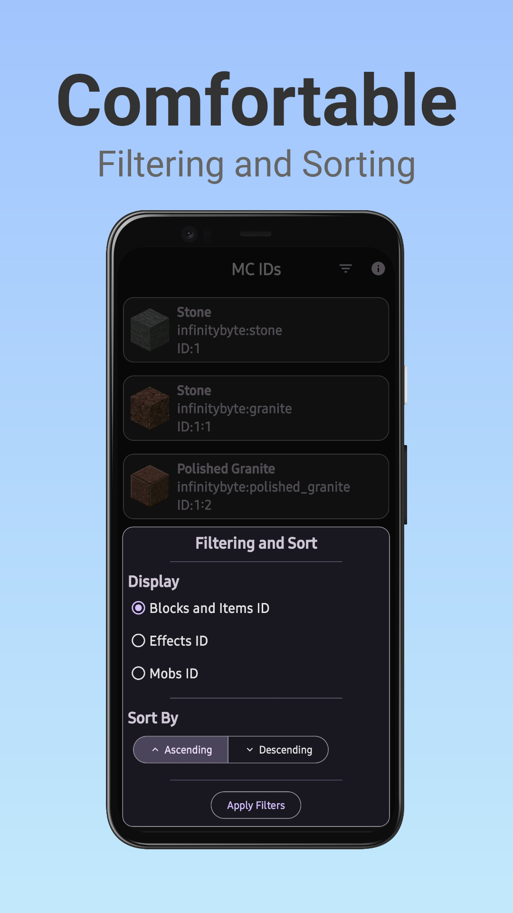
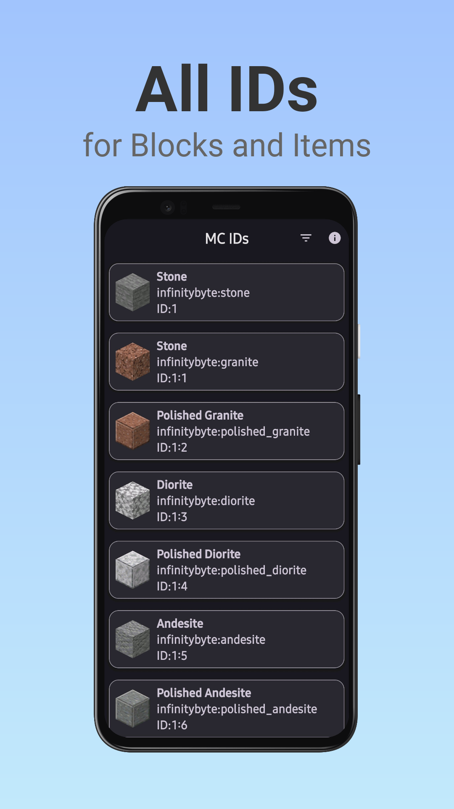
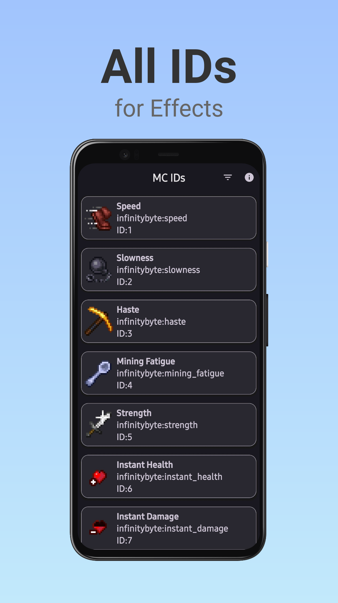
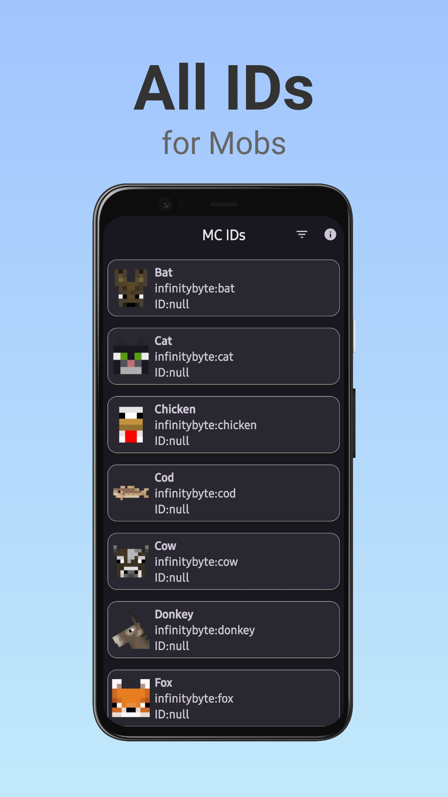

# Minecraft ID's for blocks, items, etc.

 

___

## Screenshots

## To-do list:

* [x] JSON Parse and View
* [x] Choose between IDs of blocks, items, effects, and mobs to display
* [x] Sort in ascending and descending order
* [ ] In App Update and Review
* [ ] Switch between list layout and grid layout
* [ ] Advanced sorting by letters and numbers
* [ ] Search

## Credits

* App development - [Ibragim](https://github.com/IbremMiner837)
* Beautiful [README.md](README.md) - [Kirbo](https://github.com/Kirbo) (Recursion :D)